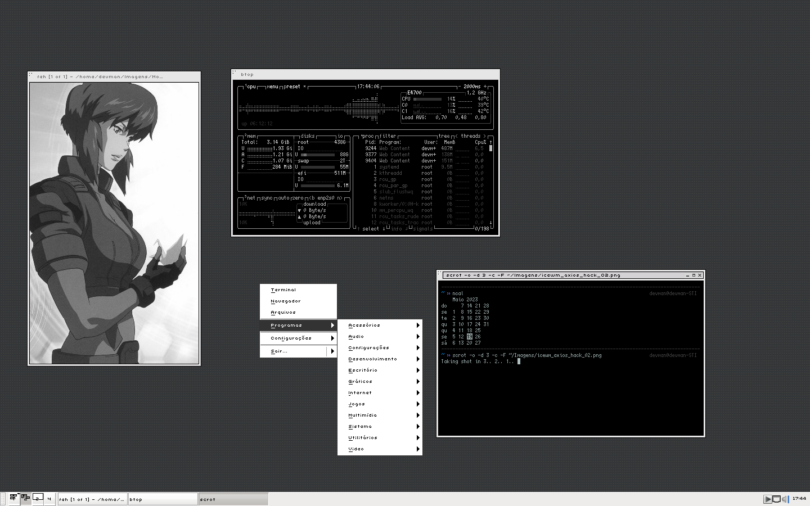

# Icewm-dot
Customize and hacking icewm preferences (hiding in menu configuration), change the images for taskbar start menu button and others settings like hotkeys and startup.

## Window decoration

+ Desktop theme for icewm (window decoration only): [Axios-Gnome Look](https://www.gnome-look.org/p/1119087)

Download and apply this theme in icewm menu - configuration - themes - axios

## Preview

### Programs in preview:
* urxvt
* btop
* ncal / cal 
* feh for image viewer with Major (searching in google pics for gits)
* scrot
* icewm desktop menu
* font in urxvt - dweep
* font in icewm - uni 05_54 and 04b08 
* Tile wallpaper in icewm folder search by *checker.png*

